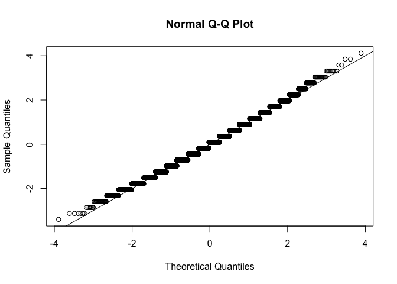
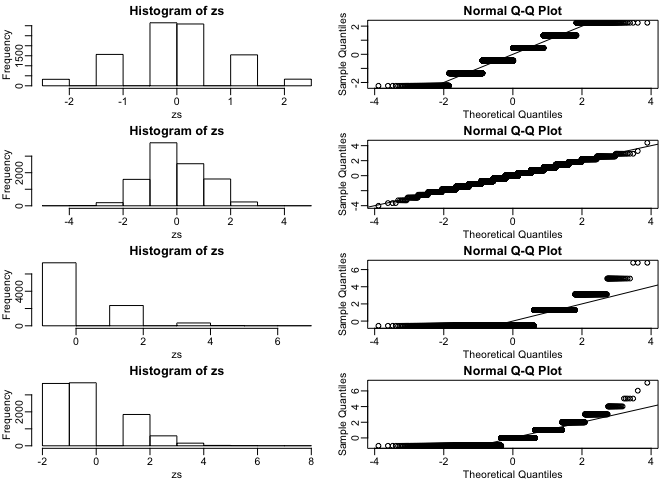

Exercises 3-13 use the mouse data set we have previously downloaded:


```r
library(downloader)
url <- "https://raw.githubusercontent.com/genomicsclass/dagdata/master/inst/extdata/femaleMiceWeights.csv"
filename <- "femaleMiceWeights.csv"
if (!file.exists("femaleMiceWeights.csv")) download(url, destfile = filename)
dat <- read.csv(filename)
```

## CLT and t-distribution in Practice Exercises #1

The CLT is a result from probability theory. Much of probability theory was originally inspired by gambling. This theory is still used in practice by casinos. For example, they can estimate how many people need to play slots for there to be a 99.9999% probability of earning enough money to cover expenses. Let's try a simple example related to gambling.

Suppose we are interested in the proportion of times we see a 6 when rolling `n=100` die. This is a random variable which we can simulate with `x=sample(1:6, n, replace=TRUE)` and the proportion we are interested in can be expressed as an average: `mean(x==6)`. Because the die rolls are independent, the CLT applies.

We want to roll n dice 10,000 times and keep these proportions. This random variable (proportion of 6s) has mean `p=1/6` and variance `p*(1-p)/n`. So according to CLT `z = (mean(x==6) - p) / sqrt(p*(1-p)/n)` should be normal with mean 0 and SD 1. Set the seed to 1, then use `replicate` to perform the simulation, and report what proportion of times `z` was larger than 2 in absolute value (CLT says it should be about 0.05).


```r
set.seed(1)
n <- 100 # number of dies in each simulation
sides <- 6
p <- 1/sides
B <- 10000 # number of simulations

zs <- replicate(B,{ # repeat below B times
  x <- sample(1:sides,n,replace = TRUE) # roll n dies
  (mean(x == 6) - p) / sqrt(p*(1 - p)/n) # calculate the z score for those 100 rolls
}) 

qqnorm(zs) # confirm distribution looks normal
abline(0,1)
```

<!-- -->

```r
mean(abs(zs) > 2) # proportion of z scores larger in abs value than 2
```

```
## [1] 0.0424
```

## CLT and t-distribution in Practice Exercises #2

For the last simulation you can make a qqplot to confirm the normal approximation. Now, the CLT is an asympototic result, meaning it is closer and closer to being a perfect approximation as the sample size increases. In practice, however, we need to decide if it is appropriate for actual sample sizes. Is 10 enough? 15? 30?

In the example used in exercise 1, the original data is binary (either 6 or not). In this case, the success probability also affects the appropriateness of the CLT. With very low probabilities, we need larger sample sizes for the CLT to "kick in".

Run the simulation from exercise 1, but for different values of p and n. For which of the following is the normal approximation best?

* p=0.5 and n=5

* **p=0.5 and n=30**

* p=0.01 and n=30

* p=0.01 and n=100


```r
ps <- c(0.5,0.5,0.01,0.01)
ns <- c(5,30,30,100)
library(rafalib)
mypar(4,2)
for (i in 1:4) {
  p <- ps[i]
  sides <- 1/p
  n <- ns[i]
  zs <- replicate(10000,{
  	x <- sample(1:sides,n,replace = TRUE)
  	(mean(x == 1) - p) / sqrt(p*(1 - p)/n)
  }) 
  hist(zs,nclass = 7)
  qqnorm(zs)
  abline(0,1)
}
```

<!-- -->

## CLT and t-distribution in Practice Exercises #3

As we have already seen, the CLT also applies to averages of quantitative data. A major difference with binary data, for which we know the variance is , is that with quantitative data we need to estimate the population standard deviation.

In several previous exercises we have illustrated statistical concepts with the unrealistic situation of having access to the entire population. In practice, we do *not* have access to entire populations. Instead, we obtain one random sample and need to reach conclusions analyzing that data. dat is an example of a typical simple dataset representing just one sample. We have 12 measurements for each of two populations:


```r
library(dplyr)
X <- filter(dat, Diet == "chow") %>% select(Bodyweight) %>% unlist
Y <- filter(dat, Diet == "hf") %>% select(Bodyweight) %>% unlist
```

We think of X as a random sample from the population of all mice in the control diet and Y as a random sample from the population of all mice in the high fat diet.

Define the parameter mu_x as the average of the control population. We estimate this parameter with the sample average X_bar. What is the sample average?


```r
X_bar <- mean(X)
X_bar
```

```
## [1] 23.81333
```

## CLT and t-distribution in Practice Exercises #4

We don't know mu_x, but want to use X_bar to understand mu_x. Which of the following uses CLT to understand how well X_bar approximates  mu_x?


* X_bar follows a normal distribution with mean 0 and standard deviation 1.

*  follows a normal distribution with mean X_bar and standard deviation sigma_x where  is the population standard deviation.

* X_bar follows a normal distribution with mean X_bar and standard deviation sigma_x/sqrt(12) where sigma_x is the population standard deviation.

* **X_bar follows a normal distribution with mean mu_x and standard deviation sigma_x/sqrt(12) where sigma_x is the population standard deviation.**

## CLT and t-distribution in Practice Exercises #5

The result above tells us the distribution of the following random variable: Z = sqrt(12)*(Xbar - mu_x)/sigma_x . What does the CLT tell us is the mean of Z (you don't need code)?

0

## CLT and t-distribution in Practice Exercises #6

The result of 4 and 5 tell us that we know the distribution of the difference between our estimate and what we want to estimate, but don't know. However, the equation involves the population standard deviation sigma_x, which we don't know. Given what we discussed, what is your estimate of sigma_x?


```r
sd(X)
```

```
## [1] 3.022541
```

## CLT and t-distribution in Practice Exercises #7

Use the CLT to approximate the probability that our estimate X_bar is off by more than 2 grams from mu_x.


```r
N <- 12
2 * pnorm(mean(X) + 2, mean = mean(X), sd = sd(X)/sqrt(N), lower.tail = FALSE)
```

```
## [1] 0.02189533
```

```r
# 2 * pnorm(2/sd(X)*sqrt(12), lower.tail = FALSE)
```

## CLT and t-distribution in Practice Exercises #8

Now we introduce the concept of a null hypothesis. We don't know  nor . We want to quantify what the data say about the possibility that the diet has no effect: . If we use CLT, then we approximate the distribution of  as normal with mean  and standard deviation  and the distribution of  as normal with mean  and standard deviation , with  the sample sizes for respectively, in this case 12. This implies that the difference  has mean . We described that the standard deviation of this statistic (the standard error) is  and that we estimate the population standard deviations  and  with the sample estimates. What is the estimate of  ?


```r
se <- sqrt(var(Y)/N + var(X)/N)
se
```

```
## [1] 1.469867
```

## CLT and t-distribution in Practice Exercises #9

So now we can compute  as well as an estimate of this standard error and construct a t-statistic. What number is this t-statistic?


```r
obs <- mean(Y) - mean(X)
tstat <- obs / se
tstat
```

```
## [1] 2.055174
```

```r
##or t.test(Y,X)$stat
```

For some of the following exercises you need to review the t-distribution that was discussed in the lecture. If you have not done so already,  you should review the related book chapters from our textbook which can also be found here and here.

In particular, you will need to remember that the t-distribution is centered at 0 and has one parameter: the degrees of freedom, that control the size of the tails. You will notice that if X follows a t-distribution the probability that X is smaller than an extreme value such as 3 SDs away from the mean grows with the degrees of freedom. For example, notice the difference between:


```r
1 - pt(3,df=3)
```

```
## [1] 0.02883444
```

```r
1 - pt(3,df=15)
```

```
## [1] 0.004486369
```

```r
1 - pt(3,df=30)
```

```
## [1] 0.002694982
```

```r
1 - pnorm(3)
```

```
## [1] 0.001349898
```

As we explained, under certain assumptions, the t-statistic follows a t-distribution. Determining the degrees of freedom can sometimes be cumbersome, but the t.test function calculates it for you. One important fact to keep in mind is that the degrees of freedom are directly related to the sample size. There are various resources for learning more about degrees of freedom on the internet as well as statistics books.

## CLT and t-distribution in Practice Exercises #10

If we apply the CLT, what is the distribution of this t-statistic?

* **Normal with mean 0 and standard deviation 1.**

* t-distributed with 22 degrees of freedom.

* Normal with mean 0 and standard deviation .

* t-distributed with 12 degrees of freedom.

## CLT and t-distribution in Practice Exercises #11

Now we are ready to compute a p-value using the CLT. What is the probability of observing a quantity as large as what we computed in 9, when the null distribution is true?


```r
2 * (1 - pnorm(tstat))
```

```
## [1] 0.0398622
```

```r
# 2*pnorm(tstat, lower.tail = FALSE)
```

## CLT and t-distribution in Practice Exercises #12

CLT provides an approximation for cases in which the sample size is large. In practice, we can't check the assumption because we only get to see 1 outcome (which you computed above). As a result, if this approximation is off, so is our p-value. As described earlier, there is another approach that does not require a large sample size, but rather that the distribution of the population is approximately normal. We don't get to see this distribution so it is again an assumption, although we can look at the distribution of the sample with qqnorm(X) and qqnorm(Y). If we are willing to assume this, then it follows that the t-statistic follows t-distribution. What is the p-value under the t-distribution approximation? Hint: use the t.test function.


```r
t.test(Y,X)$p.value
```

```
## [1] 0.05299888
```

## CLT and t-distribution in Practice Exercises #13

With the CLT distribution, we obtained a p-value smaller than 0.05 and with the t-distribution, one that is larger. They can't both be right. What best describes the difference?

* A sample size of 12 is not large enough, so we have to use the t-distribution approximation.

* **These are two different assumptions. The t-distribution accounts for the variability introduced by the estimation of the standard error and thus, under the null, large values are more probable under the null distribution.**

* The population data is probably not normally distributed so the t-distribution approximation is wrong.

* Neither assumption is useful. Both are wrong.
