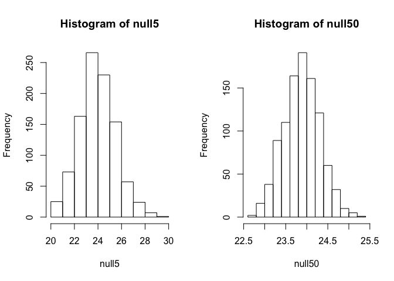

For these exercises, we will be using the following dataset:


```r
library(downloader) 
url <- "https://raw.githubusercontent.com/genomicsclass/dagdata/master/inst/extdata/femaleControlsPopulation.csv"
filename <- basename(url)
if (!file.exists(filename)) download(url,destfile = filename)
x <- unlist( read.csv(filename) )
```

Here x represents the weights for the entire population.

Using the same process as before (in Null Distribution Exercises), set the seed at 1, then using a for-loop take a random sample of 5 mice 1,000 times. Save these averages. After that, set the seed at 1, then using a for-loop take a random sample of 50 mice 1,000 times. Save these averages.


```r
set.seed(1)
n <- 1000
null5 <- vector("numeric",n)
for (i in 1:n) {
    null5[i] <- mean(sample(x, 5))
}

set.seed(1)
n <- 1000
null50 <- vector("numeric",n)
for (i in 1:n) {
    null50[i] <- mean(sample(x, 50))
}

par(mfrow = c(1,2))
hist(null5)
hist(null50)
```

<!-- -->


We recommend you review the video and read the section on normal distribution in the book before tackling these problems:

http://genomicsclass.github.io/book/pages/random_variables.html#normal_distribution

## Normal Distribution Exercises #1

Use a histogram to "look" at the distribution of averages we get with a sample size of 5 and a sample size of 50. How would you say they differ?

* They are actually the same.

* **They both look roughly normal, but with a sample size of 50 the spread is smaller.**

* They both look roughly normal, but with a sample size of 50 the spread is larger.

* The second distribution does not look normal at all.

## Normal Distribution Exercises #2

For the last set of averages, the ones obtained from a sample size of 50, what proportion are between 23 and 25?


```r
mean(null50 > 23 & null50 < 25)
```

```
## [1] 0.976
```


## Normal Distribution Exercises #3

Now ask the same question of a normal distribution with average 23.9 and standard deviation 0.43.


```r
pnorm(25, mean = 23.9, sd = 0.43) - pnorm(23, mean = 23.9, sd = 0.43)   
```

```
## [1] 0.9765648
```

```r
#pnorm( (25-23.9) / 0.43) - pnorm( (23-23.9) / 0.43) 
```

*Explanation*
The answer to 1 and 2 were very similar. This is because we can approximate the distribution of the sample average with a normal distribution. We will learn more about the reason for this next.
