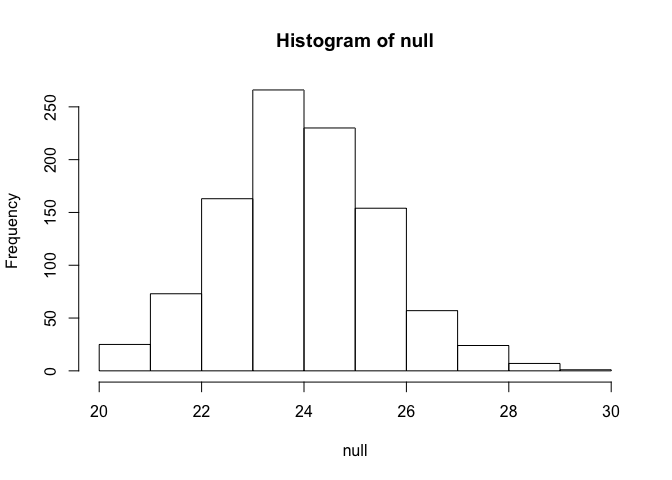
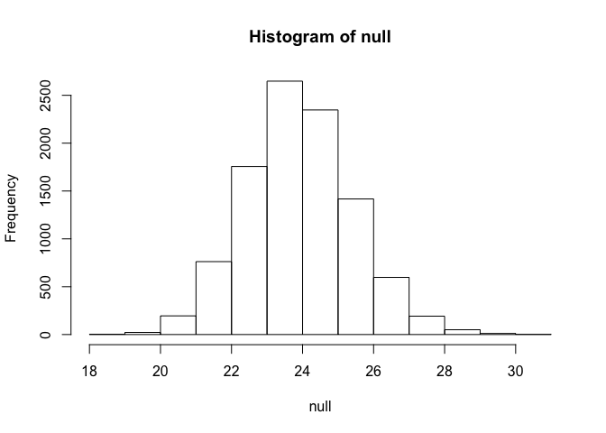
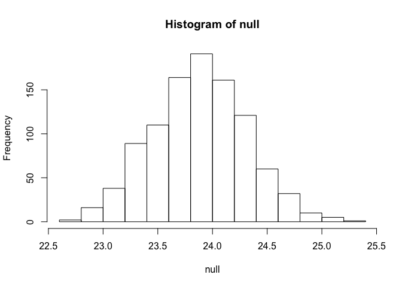

For these exercises, we will be using the following dataset:

```r
library(downloader) 
url <- "https://raw.githubusercontent.com/genomicsclass/dagdata/master/inst/extdata/femaleControlsPopulation.csv"
filename <- basename(url)
##check if file exists and if it does not, download it:
if (!file.exists(filename)) download(url,destfile = filename)
x <- unlist( read.csv(filename) )
```

Here x represents the weights for the entire population.

## Null Distributions Exercises #1

Set the seed at 1, then using a for-loop take a random sample of 5 mice 1,000 times. Save these averages. What proportion of these 1,000 averages are more than 1 gram away from the average of x ?


```r
set.seed(1)
n <- 1000
null <- vector("numeric",n)
for (i in 1:n) {
    null[i] <- mean(sample(x, 5))
}
mean(abs(null - mean(x)) > 1)
```

```
## [1] 0.498
```

```r
hist(null)
```

<!-- -->

## Null Distributions Exercises #2

We are now going to increase the number of times we redo the sample from 1,000 to 10,000. Set the seed at 1, then using a for-loop take a random sample of 5 mice 10,000 times. Save these averages. What proportion of these 10,000 averages are more than 1 gram away from the average of x ?


```r
set.seed(1)
n <- 10000
null <- vector("numeric",n)
for (i in 1:n) {
    null[i] <- mean(sample(x, 5))
}
mean(abs(null - mean(x)) > 1)
```

```
## [1] 0.4976
```

```r
hist(null)
```

<!-- -->

## Null Distributions Exercises #3

Note that the answers to 1 and 2 barely changed. This is expected. The way we think about the random value distributions is as the distribution of the list of values obtained if we repeated the experiment an infinite number of times. On a computer, we can't perform an infinite number of iterations so instead, for our examples, we consider 1,000 to be large enough, thus 10,000 is as well. Now if instead we change the sample size, then we change the random variable and thus its distribution.

Set the seed at 1, then using a for-loop take a random sample of 50 mice 1,000 times. Save these averages. What proportion of these 1,000 averages are more than 1 gram away from the average of x ?


```r
set.seed(1)
n <- 1000
null <- vector("numeric",n)
for (i in 1:n) {
    null[i] <- mean(sample(x, 50))
}
mean(abs(null - mean(x)) > 1)
```

```
## [1] 0.019
```

```r
hist(null)
```

<!-- -->

