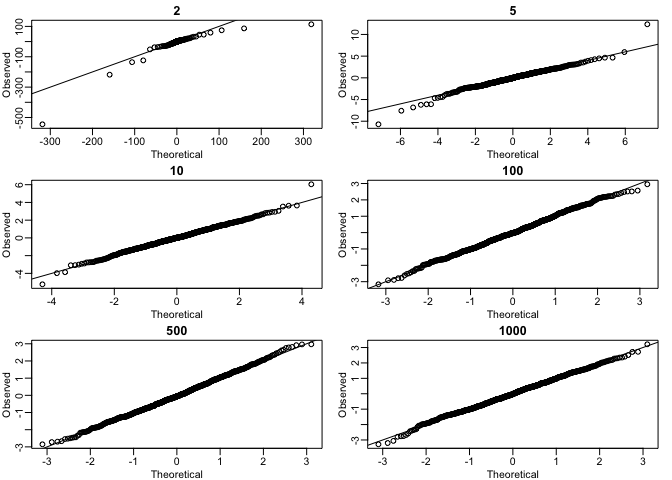
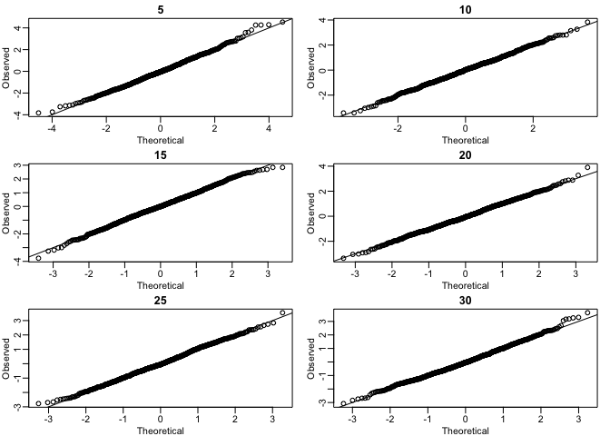
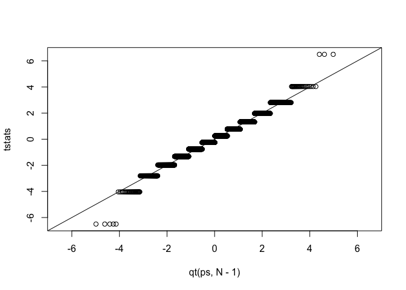
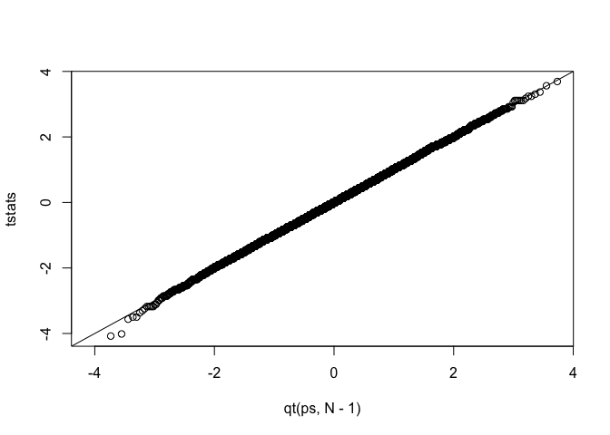
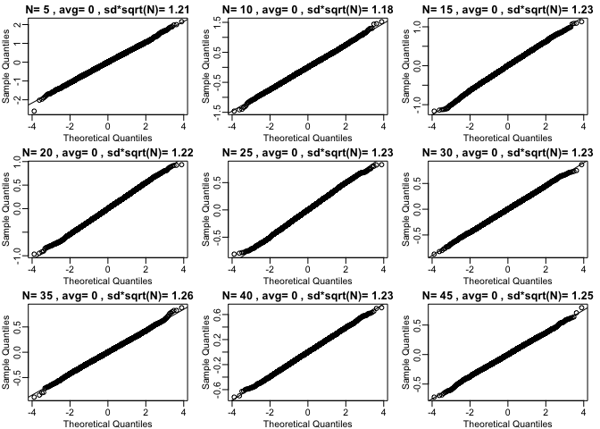

We have used Monte Carlo simulation throughout this chapter to demonstrate statistical concepts; namely, sampling from the population. We mostly applied this to demonstrate the statistical properties related to inference on differences in averages. Here, we will consider examples of how Monte Carlo simulations are used in practice.

## Monte Carlo Exercises #1

Imagine you are William_Sealy_Gosset and have just mathematically derived the distribution of the t-statistic when the sample comes from a normal distribution. Unlike Gosset you have access to computers and can use them to check the results.

Let's start by creating an outcome.

Set the seed at 1, use `rnorm` to generate a random sample of size 5, X1,...,X5 from a standard normal distribution, then compute the t-statistic `t = sqrt(5)*Xbar/s` with `s` the sample standard deviation. What value do you observe?


```r
set.seed(1)
N <- 5
X <- rnorm(N)
tstat <- (mean(X) - 0) / sqrt(var(X)/N)
tstat
```

```
## [1] 0.3007746
```

```r
# sqrt(N)*mean(X)/sd(X)
```

## Monte Carlo Exercises #2

You have just performed a Monte Carlo simulation using `rnorm`, a random number generator for normally distributed data. Gosset's mathematical calculation tells us that the t-statistic defined in the previous exercises, a random variable, follows a t-distribution with `N - 1` degrees of freedom. Monte Carlo simulations can be used to check the theory: we generate many outcomes and compare them to the theoretical result. Set the seed to 1, generate `B=1000` t-statistics as done in exercise 1. What proportion is larger than 2?


```r
N <- 5
set.seed(1)
ttestgenerator <- function(N) {
    X <- rnorm(N)
    tstat <- (mean(X) - 0) / sqrt(var(X)/N)
    return(tstat)
}
set.seed(1)
tstats <- replicate(1000, ttestgenerator(5))
mean(tstats > 2)
```

```
## [1] 0.068
```

## Monte Carlo Exercises #3

The answer to exercise 2 is very similar to the theoretical prediction: `1-pt(2,df=4)`. We can check several such quantiles using the `qqplot` function.

To obtain quantiles for the t-distribution we can generate percentiles from just above 0 to just below 1: `B=100; ps = seq(1/(B+1), 1-1/(B+1),len=B)` and compute the quantiles with `qt(ps,df=4)`. Now we can use `qqplot` to compare these theoretical quantiles to those obtained in the Monte Carlo simulation. Use Monte Carlo simulation developed for exercise 2 to corroborate that the t-statistic `t = sqrt(N)*X_bar/s` follows a t-distribution for several values of `N`.


```r
library(rafalib)
mypar(3,2)

Ns <- c(2, 5, 10, 100, 500, 1000)
B <- 1000
mypar(3,2)
for (N in Ns) {
	ts <- replicate(B, {
            X <- rnorm(N)
            sqrt(N)*mean(X)/sd(X)
    })
    ps <- seq(1/(B + 1), 1 - 1/(B + 1), len = B)
    qqplot(qt(ps, df = N - 1), ts, main = N,
           xlab = "Theoretical", ylab = "Observed")
    abline(0,1)
} 
```

<!-- -->

For which sample sizes does the approximation best work?

* Larger sample sizes.

* Smaller sample sizes.

* **The approximations are spot on for all sample sizes.**

* None. We should use CLT instead.

## Monte Carlo Exercises #4

Use Monte Carlo simulation to corroborate that the t-statistic comparing two means and obtained with normally distributed (mean 0 and sd) data follows a t-distribution. In this case we will use the t.test function with var.equal=TRUE. With this argument the degrees of freedom will be `df=2*N-2` with N the sample size. For which sample sizes does the approximation best work?


```r
Ns <- seq(5,30,5)
B <- 1000
mypar(3,2)

for (N in Ns) {
	ts <- replicate(B,{
            x <- rnorm(N)
            y <- rnorm(N)
            t.test(x,y, var.equal = TRUE)$stat
    })
    ps <- seq(1/(B + 1), 1 - 1/(B + 1), len = B)
    qqplot(qt(ps,df = 2 * N - 2),ts, main = N,
         xlab = "Theoretical", ylab = "Observed")
    abline(0,1)
}  
```

<!-- -->

* Larger sample sizes.

* Smaller sample sizes.

* **The approximations are spot on for all sample sizes.**

* None. We should use CLT instead.

## Monte Carlo Exercises #5

Is the following statement true or false? If instead of generating the sample with `X=rnorm(15)` we generate it with binary data (either positive or negative 1 with probability 0.5) `X =sample(c(-1,1), 15, replace=TRUE)` then the t-statistic


```r
tstat <- sqrt(15)*mean(X) / sd(X)
```

is approximated by a t-distribution with 14 degrees of freedom.


```r
set.seed(1)
N <- 15
B <- 10000
tstats <- replicate(B,{
  X <- sample(c(-1, 1), N, replace = TRUE)
  sqrt(N)*mean(X)/sd(X)
})
ps <- seq(1/(B + 1), 1 - 1/(B + 1), len = B) 
qqplot(qt(ps, N - 1), tstats, xlim = range(tstats))
abline(0,1)
```

<!-- -->

* true

* **false**

The population data is not normal thus the theory does not apply. We check with a Monte Carlo simulation. The qqplot shows a large tail. Note that there is a small but positive chance that all the X are the same. In this case the denominator is 0 and the t-statistics is not defined.

## Monte Carlo Exercises #6

Is the following statement true or false ? If instead of generating the sample with `X=rnorm(N)` with `N=1000`, we generate the data with binary data `X= sample(c(-1,1), N, replace=TRUE)`, then the t-statistic `sqrt(N)*mean(X)/sd(X)` is approximated by a t-distribution with 999 degrees of freedom.


```r
set.seed(1)
N <- 1000
B <- 10000
tstats <- replicate(B,{
  X <- sample(c(-1, 1), N, replace = TRUE)
  sqrt(N)*mean(X)/sd(X)
})
ps <- seq(1/(B + 1), 1 - 1/(B + 1), len = B) 
qqplot(qt(ps, N - 1), tstats, xlim = range(tstats))
abline(0,1)
```

<!-- -->

```r
#qqnorm(tstats)
#abline(0,1)
```

* **true**

* false

With N=1000, the CLT kicks in and the t-statistic is approximated with normal 0,1. Furthermore, t-distribution with df=999 and normal are practically the same.

## Monte Carlo Exercises #7

We can derive approximation of the distribution of the sample average or the t-statistic theoretically. However, suppose we are interested in the distribution of a statistic for which a theoretical approximation is not immediately obvious.

Consider the sample median as an example. Use a Monte Carlo to determine which of the following best approximates the median of a sample taken from normally distributed population with mean 0 and standard deviation 1.


```r
set.seed(1)
Ns <- seq(5, 45, 5)
library(rafalib)
mypar(3, 3)
for (N in Ns) {
  medians <- replicate(10000, median(rnorm(N)))
  title <- paste("N=", N, ", avg=", round( mean(medians), 2) , ", sd*sqrt(N)=", round( sd(medians)*sqrt(N),2) )
  qqnorm(medians, main = title )
  qqline(medians)
}
```

<!-- -->


* Just like for the average, the sample median is approximately normal with mean 0 and SD 1 / sqrt(N).

* The sample median is not approximately normal.

* The sample median is t-distributed for small samples and normally distributed for large ones.

* **The sample median is approximately normal with mean 0 and SD larger than 1 / sqrt(N).**
