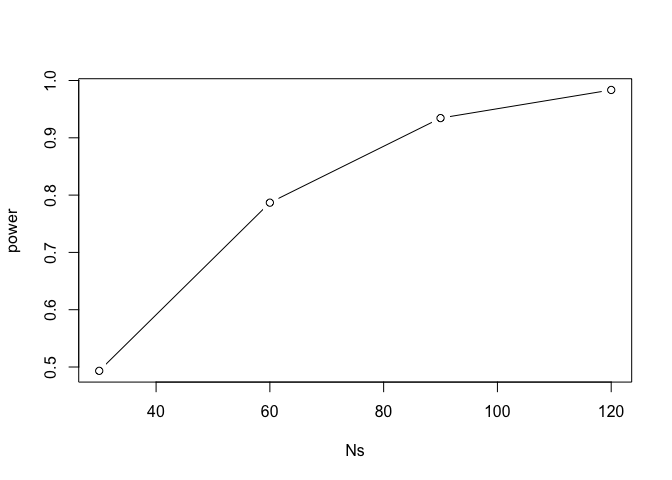
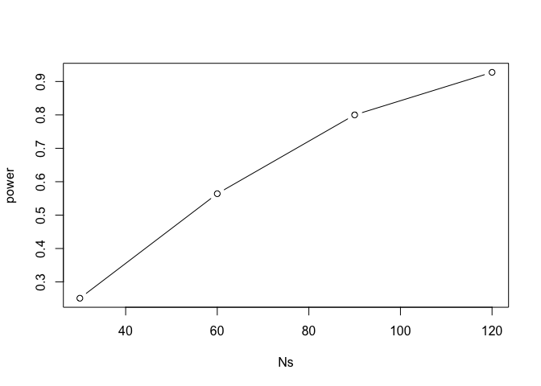

For these exercises we will load the babies dataset from babies.txt. We will use this data to review the concepts behind the p-values and then test confidence interval concepts.

```r
library(downloader)
url <- "https://raw.githubusercontent.com/genomicsclass/dagdata/master/inst/extdata/babies.txt"
filename <- basename(url)
if (!file.exists(filename)) download(url, destfile = filename)
babies <- read.table("babies.txt", header = TRUE)
```

This is a large dataset (1,236 cases), and we will pretend that it contains the entire population in which we are interested. We will study the differences in birth weight between babies born to smoking and non-smoking mothers.

First, let's split this into two birth weight datasets: one of birth weights to non-smoking mothers and the other of birth weights to smoking mothers.


```r
library(dplyr)
bwt.nonsmoke <- filter(babies, smoke == 0) %>% select(bwt) %>% unlist 
bwt.smoke <- filter(babies, smoke == 1) %>% select(bwt) %>% unlist
```

Now, we can look for the true population difference in means between smoking and non-smoking birth weights.


```r
library(rafalib)
mean(bwt.nonsmoke) - mean(bwt.smoke)
popsd(bwt.nonsmoke)
popsd(bwt.smoke)
```

The population difference of mean birth weights is about 8.9 ounces. The standard deviations of the nonsmoking and smoking groups are about 17.4 and 18.1 ounces, respectively.

As we did with the mouse weight data, this assessment interactively reviews inference concepts using simulations in R. We will treat the babies dataset as the full population and draw samples from it to simulate individual experiments. We will then ask whether somebody who only received the random samples would be able to draw correct conclusions about the population.

We are interested in testing whether the birth weights of babies born to non-smoking mothers are significantly different from the birth weights of babies born to smoking mothers.

## Power Calculations Exercises #1

We can explore the trade off of power and Type I error concretely using the babies data. Since we have the full population, we know what the true effect size is (about 8.93) and we can compute the power of the test for true difference between populations.

Set the seed at 1 and take a random sample of N=5 measurements from each of the smoking and nonsmoking datasets. You used the t-test function to find the p-value.


```r
N <- 5
set.seed(1)
dat.ns <- sample(bwt.nonsmoke, N)
dat.s <- sample(bwt.smoke, N)
t.test(dat.ns, dat.s)$p.value
```

```
## [1] 0.1366428
```

The p-value is larger than 0.05 so using the typical cut-off, we would not reject. This is a type II error. Which of the following is *not* a way to decrease this type of error?

* Increase our chance of a type I error.

* Take a larger sample size.

* **Find a population for which the null is not true.**

* Use a higher alpha level.

## Power Calculations Exercises #2

Set the seed at 1, then use the replicate function to repeat the code used in the exercise above 10,000 times. What proportion of the time do we reject at the 0.05 level?


```r
B <- 10000
N <- 5

set.seed(1)
reject <- function(N, alpha=0.05){
   dat.ns <- sample(bwt.nonsmoke, N)
   dat.s <- sample(bwt.smoke, N)
   t.test(dat.ns, dat.s)$p.value < alpha
}

rejections <- replicate(B,reject(N))
mean(rejections)
```

```
## [1] 0.0984
```

## Power Calculations Exercises #3

Note that, not surprisingly, the power is lower than 10%. Repeat the exercise above for samples sizes of 30, 60, 90 and 120. Which of those four gives you power of about 80%?


```r
Ns <- c(30, 60, 90, 120)

power <- sapply(Ns,function(N){
  rejections <- replicate(B, reject(N))
  mean(rejections)
  })
plot(Ns, power, type = "b")
```

<!-- -->

## Power Calculations Exercises #4

Repeat the problem above, but now require an  level of 0.01. Which of those four gives you power of about 80%?


```r
Ns <- c(30, 60, 90, 120)

reject <- function(N, alpha=0.01){
   dat.ns <- sample(bwt.nonsmoke, N)
   dat.s <- sample(bwt.smoke, N)
   t.test(dat.ns, dat.s)$p.value < alpha
}
set.seed(1)
power <- sapply(Ns,function(N){
  rejections <- replicate(B, reject(N))
  mean(rejections)
  })
plot(Ns, power, type = "b")
```

<!-- -->

N.B.: Reducing the alpha level (requiring greater evidence in order to reject a null hypothesis) requires a larger sample size to achieve the same power.
 
