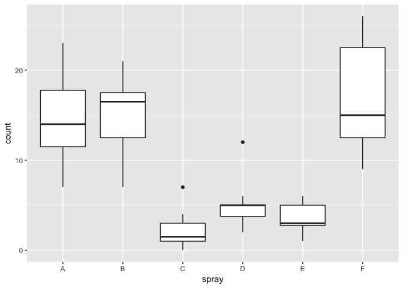
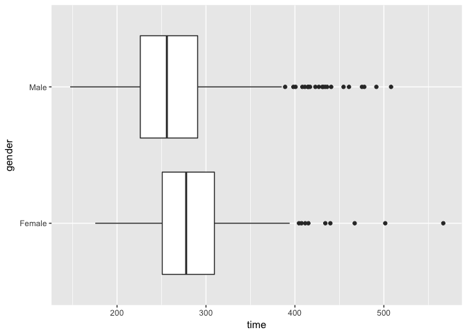
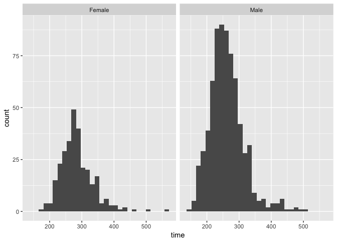
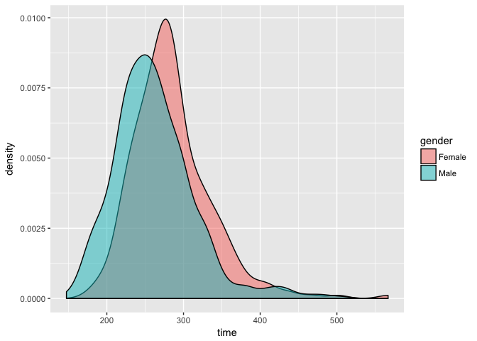

The `InsectSprays` data set measures the counts of insects in agricultural experimental units treated with different insecticides. This dataset is included in R, and you can examine it by typing:


```r
head(InsectSprays)
```

```
##   count spray
## 1    10     A
## 2     7     A
## 3    20     A
## 4    14     A
## 5    14     A
## 6    12     A
```

## Boxplot Exercises #1

Which spray seems the most effective (has the lowest median)?


```r
library(dplyr)
library(ggplot2)
ggplot(InsectSprays, aes(x = spray, y = count)) + geom_boxplot()
```

<!-- -->

```r
InsectSprays %>%
    group_by(spray) %>%
    summarize(n = n(), med_count = median(count)) %>%
    arrange(med_count)
```

```
## # A tibble: 6 x 3
##   spray     n med_count
##   <fct> <int>     <dbl>
## 1 C        12      1.50
## 2 E        12      3.00
## 3 D        12      5.00
## 4 A        12     14.0 
## 5 F        12     15.0 
## 6 B        12     16.5
```

* A

* B

* **C**

* D

* E

## Boxplot Exercises #2

Let's consider a random sample of finishers from the New York City Marathon in 2002. This dataset can be found in the UsingR package. Load the library and then load the `nym.2002` dataset.

Use boxplots and histograms to compare the finishing times of males and females. Which of the following best describes the difference?

The boxplot and density plot do a good job of showing how the male and female distributions have a similar shape (slightly right skewed) with the male center shifted to the left (faster times). The histogram reminds us of the much greater number of male finishers.


```r
data(nym.2002, package = "UsingR")
ggplot(nym.2002, aes(x = gender, y = time)) + geom_boxplot() + coord_flip()
```

<!-- -->

```r
ggplot(nym.2002, aes(x = time)) + geom_histogram() + facet_wrap(~ gender)
```

```
## `stat_bin()` using `bins = 30`. Pick better value with `binwidth`.
```

<!-- -->

```r
ggplot(nym.2002, aes(x = time, fill = gender)) + geom_density(alpha = 0.5)
```

<!-- -->

* Males and females have the same distribution.

* Most males are faster than most women.

* **Male and females have similar right skewed distributions with the former, 20 minutes shifted to the left.**

* Both distribution are normally distributed with a difference in mean of about 30 minutes.
