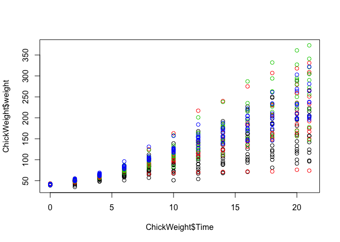
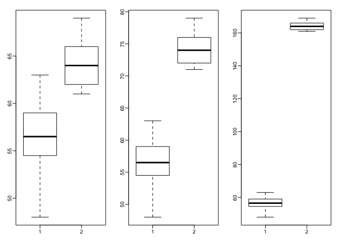

We are going to explore the properties of robust statistics. We will use one of the datasets included in R, which contains weight of chicks in grams as they grow from day 0 to day 21. This dataset also splits up the chicks by different protein diets, which are coded from 1 to 4. We use this dataset to also show an important operation in R (not related to robust summaries): reshape.

This dataset is built into R and can be loaded with:


```r
data(ChickWeight)
```

To begin, take a look at the weights of all observations over time and color the points to represent the Diet:


```r
head(ChickWeight)
```

```
##   weight Time Chick Diet
## 1     42    0     1    1
## 2     51    2     1    1
## 3     59    4     1    1
## 4     64    6     1    1
## 5     76    8     1    1
## 6     93   10     1    1
```

```r
plot( ChickWeight$Time, ChickWeight$weight, col = ChickWeight$Diet)
```

<!-- -->

First, notice that the rows here represent time points rather than individuals. To facilitate the comparison of weights at different time points and across the different chicks, we will reshape the data so that each row is a chick. In R we can do this with the reshape function:


```r
chick <- reshape(ChickWeight, idvar = c("Chick","Diet"), timevar = "Time",
                direction = "wide")
```

The meaning of this line is: reshape the data from _long_ to _wide_, where the columns Chick and Diet are the ID's and the column Time indicates different observations for each ID. Now examine the head of this dataset:


```r
head(chick)
```

```
##    Chick Diet weight.0 weight.2 weight.4 weight.6 weight.8 weight.10
## 1      1    1       42       51       59       64       76        93
## 13     2    1       40       49       58       72       84       103
## 25     3    1       43       39       55       67       84        99
## 37     4    1       42       49       56       67       74        87
## 49     5    1       41       42       48       60       79       106
## 61     6    1       41       49       59       74       97       124
##    weight.12 weight.14 weight.16 weight.18 weight.20 weight.21
## 1        106       125       149       171       199       205
## 13       122       138       162       187       209       215
## 25       115       138       163       187       198       202
## 37       102       108       136       154       160       157
## 49       141       164       197       199       220       223
## 61       141       148       155       160       160       157
```

We also want to remove any chicks that have missing observations at any time points (NA for "not available"). The following line of code identifies these rows and then removes them:


```r
chick <- na.omit(chick)
```

## Mann-Whitney-Wilcoxon Test Exercises #1

Save the weights of the chicks on day 4 from diet 1 as a vector `x`. Save the weights of the chicks on day 4 from diet 4 as a vector `y`. Perform a t-test comparing x and y (in R the function `t.test(x,y)` will perform the test). Then perform a Wilcoxon test of x and y (in R the function wilcox.test(x,y) will perform the test). A warning will appear that an exact p-value cannot be calculated with ties, so an approximation is used, which is fine for our purposes.


```r
library(dplyr)
x <- chick %>% filter(Diet == 1) %>% select(weight.4) %>% unlist()
y <- chick %>% filter(Diet == 4) %>% select(weight.4) %>% unlist()
t.test(x,y)
```

```
## 
## 	Welch Two Sample t-test
## 
## data:  x and y
## t = -5.8393, df = 21.827, p-value = 7.32e-06
## alternative hypothesis: true difference in means is not equal to 0
## 95 percent confidence interval:
##  -10.513134  -5.000755
## sample estimates:
## mean of x mean of y 
##  56.68750  64.44444
```

```r
wilcox.test(x,y)
```

```
## Warning in wilcox.test.default(x, y): cannot compute exact p-value with
## ties
```

```
## 
## 	Wilcoxon rank sum test with continuity correction
## 
## data:  x and y
## W = 6, p-value = 0.0002012
## alternative hypothesis: true location shift is not equal to 0
```

Perform a t-test of x and y, after adding a single chick of weight 200 grams to x (the diet 1 chicks). What is the p-value from this test? The p-value of a test is available with the following code: t.test(x,y)$p.value


```r
t.test(c(x,200),y)$p.value
```

```
## [1] 0.9380347
```

## Mann-Whitney-Wilcoxon Test Exercises #2

Do the same for the Wilcoxon test. The Wilcoxon test is robust to the outlier. In addition, it has less assumptions that the t-test on the distribution of the underlying data.


```r
wilcox.test(c(x,200),y)$p.value
```

```
## Warning in wilcox.test.default(c(x, 200), y): cannot compute exact p-value
## with ties
```

```
## [1] 0.0009840921
```

## Mann-Whitney-Wilcoxon Test Exercises #3

We will now investigate a possible downside to the Wilcoxon-Mann-Whitney test statistic. Using the following code to make three boxplots, showing the true Diet 1 vs 4 weights, and then two altered versions: one with an additional difference of 10 grams and one with an additional difference of 100 grams. Use the x and y as defined above, NOT the ones with the added outlier.


```r
library(rafalib)
mypar(1,3)
boxplot(x,y)
boxplot(x,y+10)
boxplot(x,y+100)
```

<!-- -->

What is the difference in t-test statistic (obtained by `t.test(x,y)$statistic`) between adding 10 and adding 100 to all the values in the group 'y'? Take the the t-test statistic with x and y+10 and subtract the t-test statistic with x and y+100. The value should be positive.


```r
t.test(x, y + 10)$statistic - t.test(x, y + 100)$statistic
```

```
##        t 
## 67.75097
```

## Mann-Whitney-Wilcoxon Test Exercises #4

Examine the Wilcoxon test statistic for x and y+10 and for x and y+100. Because the Wilcoxon works on ranks, once the two groups show complete separation, that is all points from group 'y' are above all points from group 'x', the statistic will not change, regardless of how large the difference grows. Likewise, the p-value has a minimum value, regardless of how far apart the groups are. This means that the Wilcoxon test can be considered less powerful than the t-test in certain contexts. In fact, for small sample sizes, the p-value can't be very small, even when the difference is very large. What is the p-value if we compare c(1,2,3) to c(4,5,6) using a Wilcoxon test?


```r
wilcox.test(c(x, y + 10))$p.value
```

```
## Warning in wilcox.test.default(c(x, y + 10)): cannot compute exact p-value
## with ties
```

```
## [1] 1.297665e-05
```

```r
wilcox.test(c(x, y + 100))$p.value
```

```
## Warning in wilcox.test.default(c(x, y + 100)): cannot compute exact p-value
## with ties
```

```
## [1] 1.297665e-05
```

```r
wilcox.test(c(1,2,3), c(4,5,6))$p.value
```

```
## [1] 0.1
```

## Mann-Whitney-Wilcoxon Test Exercises #5

What is the p-value if we compare c(1,2,3) to c(400,500,600) using a Wilcoxon test?


```r
wilcox.test(c(1,2,3), c(400,500,600))$p.value
```

```
## [1] 0.1
```

