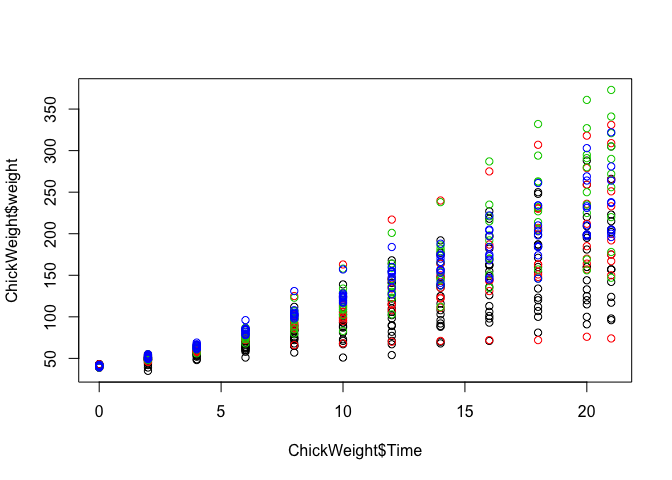
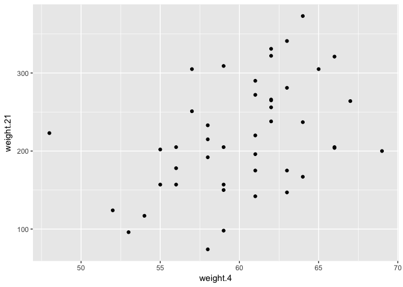

We are going to explore the properties of robust statistics. We will use one of the datasets included in R, which contains weight of chicks in grams as they grow from day 0 to day 21. This dataset also splits up the chicks by different protein diets, which are coded from 1 to 4. We use this dataset to also show an important operation in R (not related to robust summaries): `reshape`.

This dataset is built into R and can be loaded with:


```r
data(ChickWeight)
```

To begin, take a look at the weights of all observations over time and color the points to represent the Diet:


```r
head(ChickWeight)
```

```
##   weight Time Chick Diet
## 1     42    0     1    1
## 2     51    2     1    1
## 3     59    4     1    1
## 4     64    6     1    1
## 5     76    8     1    1
## 6     93   10     1    1
```

```r
plot( ChickWeight$Time, ChickWeight$weight, col = ChickWeight$Diet)
```

<!-- -->

First, notice that the rows here represent time points rather than individuals. To facilitate the comparison of weights at different time points and across the different chicks, we will reshape the data so that each row is a chick. In R we can do this with the reshape function:


```r
chick <- reshape(ChickWeight, idvar = c("Chick","Diet"), timevar = "Time",
                direction = "wide")
```

The meaning of this line is: reshape the data from _long_ to _wide_, where the columns Chick and Diet are the ID's and the column Time indicates different observations for each ID. Now examine the head of this dataset:


```r
head(chick)
```

```
##    Chick Diet weight.0 weight.2 weight.4 weight.6 weight.8 weight.10
## 1      1    1       42       51       59       64       76        93
## 13     2    1       40       49       58       72       84       103
## 25     3    1       43       39       55       67       84        99
## 37     4    1       42       49       56       67       74        87
## 49     5    1       41       42       48       60       79       106
## 61     6    1       41       49       59       74       97       124
##    weight.12 weight.14 weight.16 weight.18 weight.20 weight.21
## 1        106       125       149       171       199       205
## 13       122       138       162       187       209       215
## 25       115       138       163       187       198       202
## 37       102       108       136       154       160       157
## 49       141       164       197       199       220       223
## 61       141       148       155       160       160       157
```

We also want to remove any chicks that have missing observations at any time points (NA for "not available"). The following line of code identifies these rows and then removes them:


```r
chick <- na.omit(chick)
```

## Median, MAD, and Spearman Correlation Exercises #1

Focus on the chick weights on day 4 (check the column names of 'chick' and note the numbers). How much does the average of chick weights at day 4 increase if we add an outlier measurement of 3000 grams? Specifically, what is the average weight of the day 4 chicks, including the outlier chick, divided by the average of the weight of the day 4 chicks without the outlier. Hint: use c to add a number to a vector.


```r
mean(c(chick$weight.4, 3000)) - mean(chick$weight.4)
```

```
## [1] 63.90966
```

```r
mean(c(chick$weight.4, 3000)) / mean(chick$weight.4)
```

```
## [1] 2.062407
```


## Median, MAD, and Spearman Correlation Exercises #2

In exercise 1, we saw how sensitive the mean is to outliers. Now let's see what happens when we use the median instead of the mean. Compute the same ratio, but now using median instead of mean. Specifically, what is the median weight of the day 4 chicks, including the outlier chick, divided by the median of the weight of the day 4 chicks without the outlier.


```r
median(c(chick$weight.4, 3000)) / median(chick$weight.4)
```

```
## [1] 1
```

## Median, MAD, and Spearman Correlation Exercises #3

Now try the same thing with the sample standard deviation (the sd function in R). Add a chick with weight 3000 grams to the chick weights from day 4. How much does the standard deviation change? What's the standard deviation with the outlier chick divided by the standard deviation without the outlier chick?


```r
sd(c(chick$weight.4, 3000)) - sd(chick$weight.4)
```

```
## [1] 429.1973
```

```r
sd(c(chick$weight.4, 3000)) / sd(chick$weight.4)
```

```
## [1] 101.2859
```

## Median, MAD, and Spearman Correlation Exercises #4

Compare the result above to the median absolute deviation in R, which is calculated with the mad function. Note that the mad is unaffected by the addition of a single outlier. The mad function in R includes the scaling factor 1.4826, such that mad and sd are very similar for a sample from a normal distribution. What's the MAD with the outlier chick divided by the MAD without the outlier chick?


```r
mad(c(chick$weight.4, 3000)) / mad(chick$weight.4)
```

```
## [1] 1
```

## Median, MAD, and Spearman Correlation Exercises #5

Our last question relates to how the Pearson correlation is affected by an outlier as compared to the Spearman correlation. The Pearson correlation between x and y is given in R by `cor(x,y)`. The Spearman correlation is given by `cor(x,y,method="spearman")`.

Plot the weights of chicks from day 4 and day 21. We can see that there is some general trend, with the lower weight chicks on day 4 having low weight again on day 21, and likewise for the high weight chicks.


```r
library(ggplot2)
ggplot(chick, aes(x = weight.4, y = weight.21)) + geom_point()
```

<!-- -->

Calculate the Pearson correlation of the weights of chicks from day 4 and day 21. Now calculate how much the Pearson correlation changes if we add a chick that weighs 3000 on day4 and 3000 on day 21. Again, divide the Pearson correlation with the outlier chick over the Pearson correlation computed without the outliers.


```r
cor(chick$weight.4, chick$weight.21)
```

```
## [1] 0.4159499
```

```r
cor(c(chick$weight.4, 3000), c(chick$weight.21,3000)) - cor(chick$weight.4, chick$weight.21)
```

```
## [1] 0.5701503
```

```r
cor(c(chick$weight.4, 3000), c(chick$weight.21,3000)) / cor(chick$weight.4, chick$weight.21)
```

```
## [1] 2.370719
```


