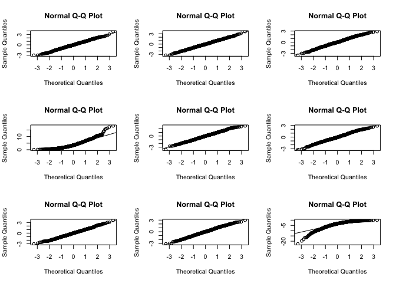
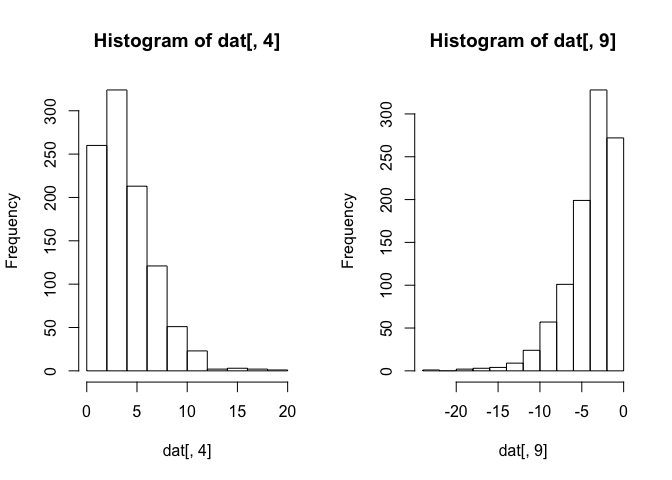
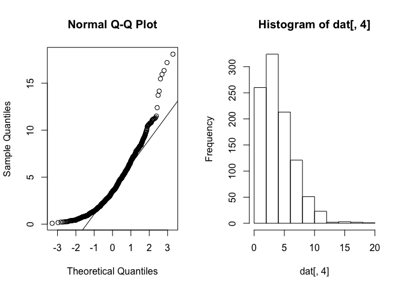
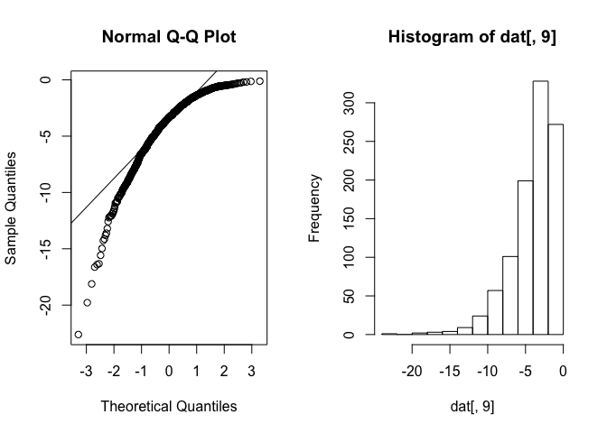
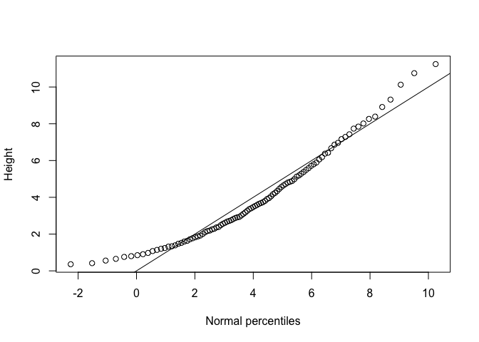

Download this RData file to your working directory: link. Then load the data into R with the following command:


```r
library(downloader) 
url <- "http://courses.edx.org/c4x/HarvardX/PH525.1x/asset/skew.RData"
filename <- basename(url)
if (!file.exists(filename)) download(url,destfile = filename)
load("skew.RData")
```

You should have a 1000 x 9 dimensional matrix 'dat':


```r
dim(dat)
```

```
## [1] 1000    9
```

Using QQ-plots, compare the distribution of each column of the matrix to a normal. That is, use qqnorm() on each column. To accomplish this quickly, you can use the following line of code to set up a grid for 3x3=9 plots. ("mfrow" means we want a multifigure grid filled in row-by-row. Another choice is mfcol.)

Then you can use a for loop, to loop through the columns, and display one qqnorm() plot at a time. 

Identify the two columns which are skewed.

Examine each of these two columns using a histogram. Note which column has "positive skew", in other words the histogram shows a long tail to the right (toward larger values). Note which column has "negative skew", that is, a long tail to the left (toward smaller values). Note that positive skew looks like an up-shaping curve in a qqnorm() plot, while negative skew looks like a down-shaping curve.


```r
par(mfrow = c(3,3))
for (i in 1:9) {
    qqnorm(dat[,i])
    qqline(dat[,i])
}
```

<!-- -->

```r
par(mfrow = c(1,1))
```

**4 and 9 are skewed.**


```r
par(mfrow = c(1,2))
hist(dat[,4]) # positive skew tails to the right
hist(dat[,9]) # negative skew tails to the left
```

<!-- -->

## QQ-plot Exercises #1

Which column has positive skew (a long tail to the right)? **4**


```r
par(mfrow = c(1,2))
qqnorm(dat[,4])
qqline(dat[,4])
hist(dat[,4]) 
```

<!-- -->

## QQ-plot Exercises #2

Which column has negative skew (a long tail to the left)? **9**


```r
par(mfrow = c(1,2))
qqnorm(dat[,9])
qqline(dat[,9])
hist(dat[,9]) 
```

<!-- -->

We could have done Exercise 1 by hand and got the similar result below.


```r
x <- dat[,4]
ps <- seq(0.01, 0.99, 0.01)
qs <- quantile(x, ps)
normalqs <- qnorm(ps, mean(x), sd(x))
plot(normalqs, qs, xlab = "Normal percentiles", ylab = "Height")
abline(0,1)
```

<!-- -->
