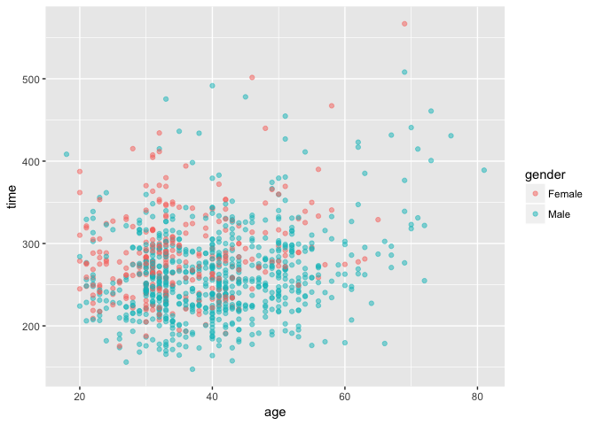
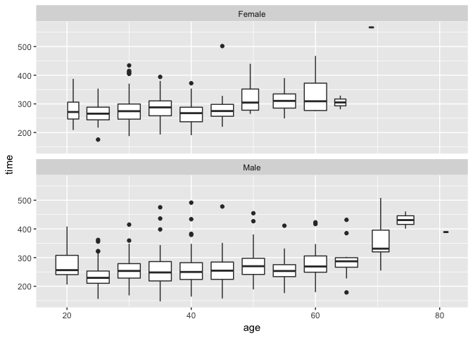

Let's consider a random sample of finishers from the New York City Marathon in 2002. This dataset can be found in the UsingR package. Load the library and then load the `nym.2002` dataset.

Here we will use the plots we've learned about to explore a dataset: some stats on a random sample of runners from the New York City Marthon in 2002. This data set can be found in the `UsingR` package (used in the previous assessment). Load the library and then load the `nym.2002` data set with the following line:


```r
data(nym.2002, package = "UsingR")
```

## Scatterplot Exercises #1

Use dplyr to create two new data frames: males and females, with the data for each gender. For males, what is the Pearson correlation between age and time to finish?


```r
library(dplyr)
males <- nym.2002 %>% filter(gender == "Male")
females <- nym.2002 %>% filter(gender == "Female")

cor(males$age, males$time)
```

```
## [1] 0.2432273
```

## Scatterplot Exercises #2

For females, what is the Pearson correlation between age and time to finish?


```r
cor(females$age, females$time)
```

```
## [1] 0.2443156
```


## Scatterplot Exercises #3

If we interpret these correlations without visualizing the data, we would conclude that the older we get, the slower we run marathons, regardless of gender. Look at scatterplots and boxplots of times stratified by age groups (20-25, 25-30, etc..). After examining the data, what is a more reasonable conclusion?


```r
library(ggplot2)
nym.2002 %>%
    filter(!age == 5) %>% # remove probable data entry error
    ggplot(aes(x = age, y = time, color = gender)) + 
        geom_point(alpha = 0.5)
```

<!-- -->

```r
nym.2002 %>%
    filter(!age == 5) %>%
    ggplot(aes(x = age, y = time)) + 
        geom_boxplot(aes(group = cut_width(age, 5))) +
        facet_wrap(~ gender, ncol = 1)
```

<!-- -->

* **Finish times are constant up through around 50-60, then we get slower.**

* On average, finish times go up by about 7 minutes every five years.

* The optimal age to run a marathon is 20-25.

* Coding errors never happen: a five year old boy completed the 2012 NY city marathon.
