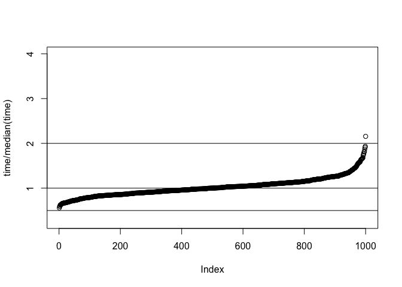
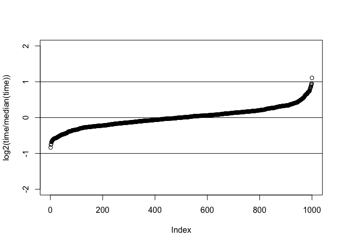

In the previous video, we saw that multiplicative changes are symmetric around 0 when we are on the logarithmic scale. In other words, if we use the log scale, 1/2 times a number x, and 2 times a number x, are equally far away from x. We will explore this with the NYC marathon data.

Create a vector time of the sorted times:


```r
data(nym.2002, package = "UsingR")
time <- sort(nym.2002$time)
```

## Symmetry of Log Ratios Exercises #1

What is the fastest time divided the median time?


```r
min(time) / median(time)
```

```
## [1] 0.5605402
```


## Symmetry of Log Ratios Exercises #2

What is the slowest time divided the median time?


```r
max(time) / median(time)
```

```
## [1] 2.156368
```


Compare the following two plots.

1) A plot of the ratio of times to the median time, with horizontal lines at twice as fast as the median time, and twice as slow as the median time.


```r
plot(time/median(time), ylim = c(1/4,4))
abline(h = c(1/2,1,2))
```

<!-- -->


2) A plot of the log2 ratio of times to the median time. The horizontal lines indicate the same as above: twice as fast and twice as slow.


```r
plot(log2(time/median(time)),ylim = c(-2,2))
abline(h = -1:1)
```

<!-- -->

Note that the lines are equally spaced in Figure #2.
